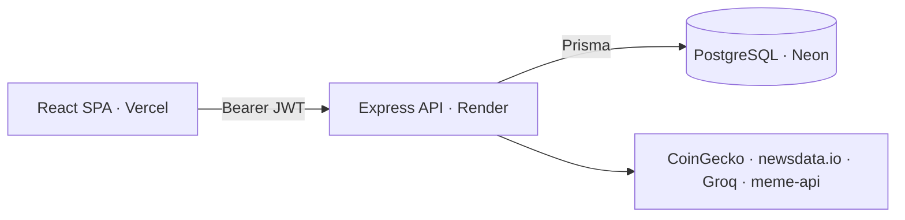

<p align="center">
  
</p>

# CryptoAdvisor

> A personalized crypto investor dashboard with a pirate/treasure theme. Users
> complete a short onboarding quiz, then get a daily, tailored dashboard of
> market data, news, an AI-generated insight, and a fresh meme - each item
> votable with a thumbs up/down that is persisted for future personalization.

---

## Live demo

- **Frontend:** `https://crypto-advisor-frontend-ten.vercel.app`
- **Backend:** `https://cryptoadvisor-wery.onrender.com` (health: `/api/health`)

> Free-tier backend sleeps when idle - the first request may take ~30-60s to wake.

---

## Features

- **Auth** - JWT signup/login, bcrypt-hashed passwords, route guards.
- **Onboarding quiz** - captures assets, investor type, and content preferences.
- **Personalized dashboard** - renders only the cards the user opted into:
  prices (CoinGecko) · news (newsdata.io) · AI insight (Groq) · meme.
- **Voting** - toggleable upvote downvote per item, persisted per user.
- **Resilient** - each source has a fallback + short in-memory cache, so one
  failing API never breaks the dashboard.

---

## Tech stack

**Frontend:** React 18 · TypeScript · Vite · Material UI (v9) · Tailwind CSS v3 ·
TanStack React Query · React Hook Form · Zod · React Router v6 · Axios

**Backend:** Node.js · TypeScript · Express · Prisma · PostgreSQL (Neon) ·
JWT (`jsonwebtoken`) · `bcryptjs` · in-memory TTL cache

**Infra:** npm workspaces monorepo · Vercel (frontend) · Render (backend) · Neon (db)

---

## Architecture



- **Stateless JWT auth** - token in `localStorage`, attached via an Axios
  interceptor, verified in Express middleware. _(httpOnly cookie = production
  hardening step.)_
- **React Query owns all server state** (`me`, `preferences`, `dashboard`,
  `votes`); logout clears the cache so users never see each other's data.
- **Parallel fetch + per-source fallback** - the dashboard endpoint runs all
  four sources with `Promise.all`, each with its own try/catch and TTL cache.

---

## Data model

```
User        (id, email, name, passwordHash, createdAt)
Preference  (userId, assets[], contentTypes[], investorType, onboarded)   // 1-1 with User
Vote        (id, userId, section, itemRef, value ±1)                      // unique(userId, section, itemRef)
```

Only user state is stored - dashboard content is fetched live, never persisted.
Re-clicking a vote toggles it off; switching up/down updates it.

| Card       | API                         | Cache  | Fallback                         |
| ---------- | --------------------------- | ------ | -------------------------------- |
| Prices     | CoinGecko                   | 60s    | empty state                      |
| News       | newsdata.io                 | 15 min | empty state                      |
| AI insight | Groq `llama-3.1-8b-instant` | 6h     | canned insight per investor type |
| Meme       | meme-api                    | none   | bundled local image              |

---

## API

All routes are under `/api`; everything except auth requires a `Bearer` token.

| Method     | Route                          | Purpose                                      |
| ---------- | ------------------------------ | -------------------------------------------- |
| POST       | `/auth/signup` · `/auth/login` | register / log in → `{ user, token }`        |
| GET        | `/auth/me`                     | current user (or 401)                        |
| GET · PUT  | `/preferences`                 | read / upsert prefs (sets `onboarded`)       |
| GET        | `/dashboard`                   | `{ prices, news, aiInsight, meme }` by prefs |
| GET · POST | `/votes`                       | list user votes / upsert (toggle) a vote     |

---

## Local development

Requires Node 18+ and a PostgreSQL URL (e.g. a free Neon DB).

```bash
npm install                                   # installs both workspaces
cp backend/.env.example backend/.env          # then fill in values
cd backend && npx prisma migrate deploy && cd ..

npm run dev:backend     # http://localhost:4000
npm run dev:frontend    # http://localhost:5173
```

**Backend env:** `DATABASE_URL`, `JWT_SECRET`, `CLIENT_ORIGIN`,
`COINGECKO_API_KEY`, `NEWSDATA_API_KEY`, `GROQ_API_KEY`
**Frontend env:** `VITE_API_URL` (e.g. `https://<backend>/api`)

---

## Deployment

- **Backend → Render** - root `backend`; build `prisma generate && tsc`; start
  `prisma migrate deploy && node dist/index.js`; CORS locked to `CLIENT_ORIGIN`.
- **Frontend → Vercel** - root `frontend`, Vite preset; `vercel.json` rewrites
  all routes to `index.html` for SPA routing.
- **Database → Neon** - serverless PostgreSQL; migrations run on backend start.

---

## Bonus - feedback → model-improvement loop _(conceptual)_

Each vote is already a structured signal `(userId, section, itemRef, value)`.
That dataset enables a feedback loop:

1. **Collect** - pair each vote with the rated content and the user's profile;
   for AI insights, also store the prompt + output.
2. **Aggregate** - build per-user taste vectors (re-rank what they see) and
   global content-quality scores (down-weight consistently disliked sources).
3. **Understand the persona** - run AI/ML models directly over the stored
   profile + vote data to refine each user's persona beyond the onboarding quiz:
   cluster users into segments, predict their true investor type from behaviour,
   and surface which topics actually engage them - so the dashboard adapts to
   what users _do_, not just what they once selected.
4. **Improve the AI** - start with prompt tuning (upvoted insights as few-shot
   examples), then, with enough (preferred, rejected) pairs, apply DPO/RLHF-style
   preference fine-tuning. Evaluate offline on held-out votes before shipping.
5. **Close the loop** - A/B test, compare upvote rates, feed new votes back in.

_Guardrails: explicit consent, anonymized/aggregated training data, vote
rate-limiting, and human review before auto-suppressing any source._

---

## AI tools usage

I used **GitHub Copilot** as a review-first pair programmer - I drove the
architecture and decisions; it accelerated implementation and debugging:

- **Design discussions** - auth strategy (localStorage JWT vs httpOnly cookie),
  caching, and resilience trade-offs.
- **Scaffolding** - typed boilerplate for Express routes, Prisma models, the
  Axios client, React Query hooks, and Zod forms.
- **Debugging** - e.g. a header not refreshing on user switch (non-reactive
  token + stale cache) and a backend that "looked running" but had crashed on a
  Neon cold-start.
- **UI & deployment** - the pirate theme and the Render/Vercel/Neon setup.

Changes were kept small and incremental, with hard checks and code review
